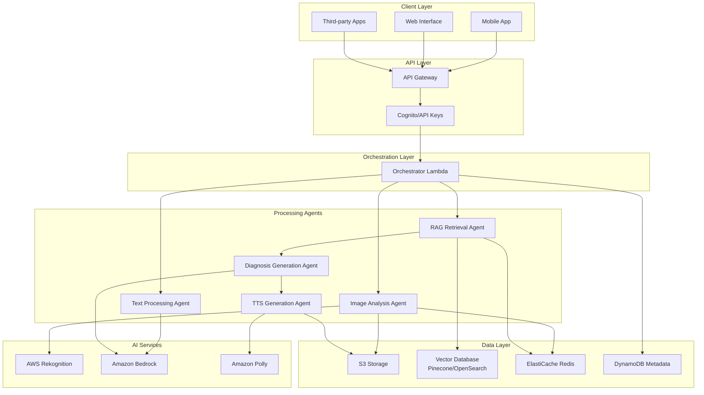
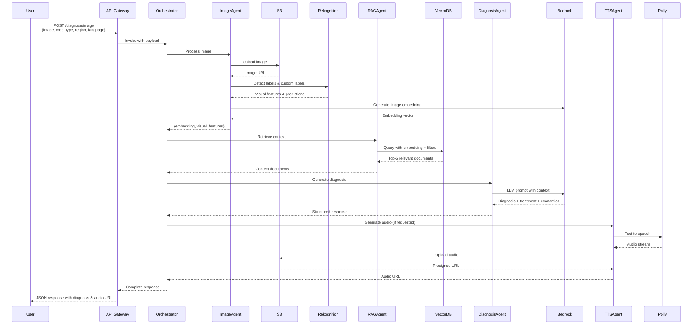
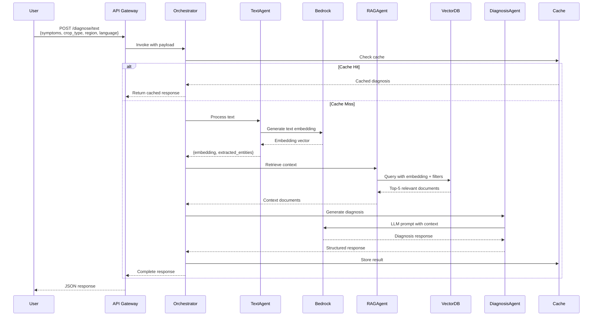
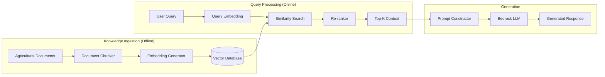
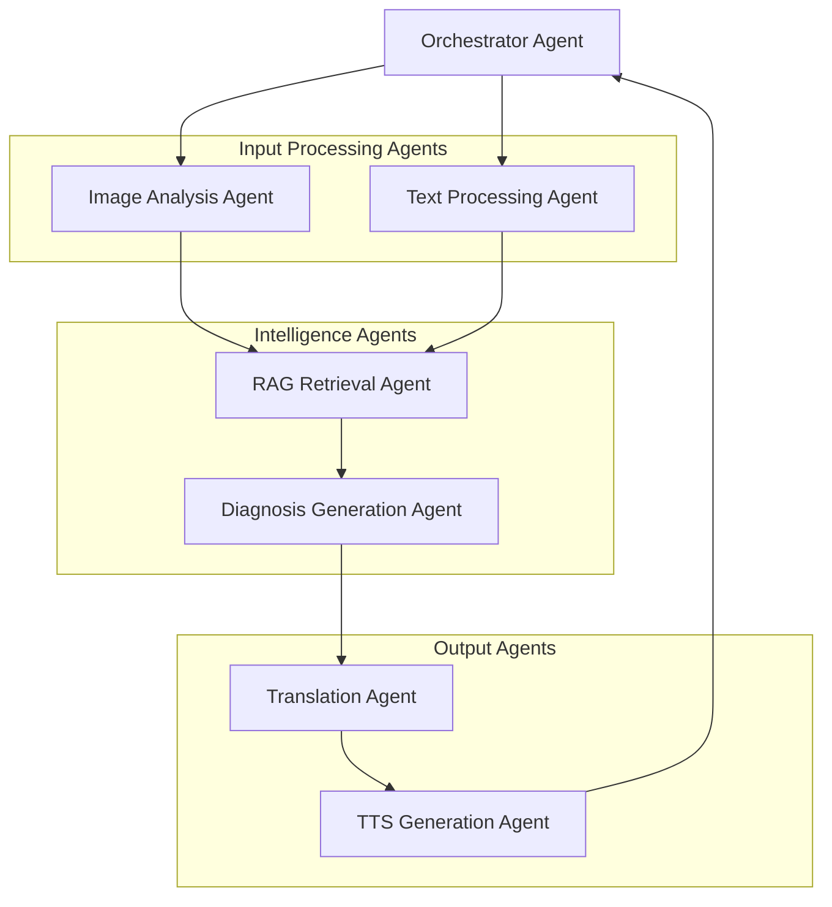
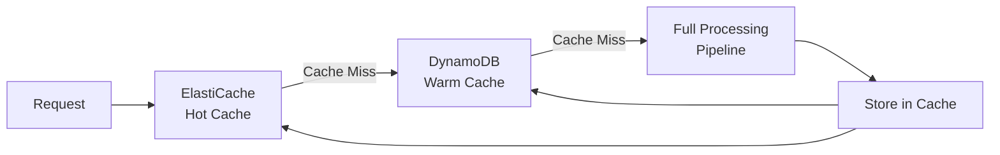
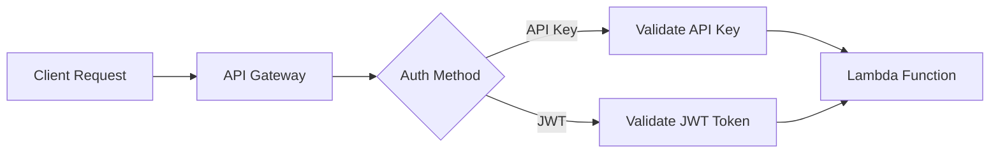
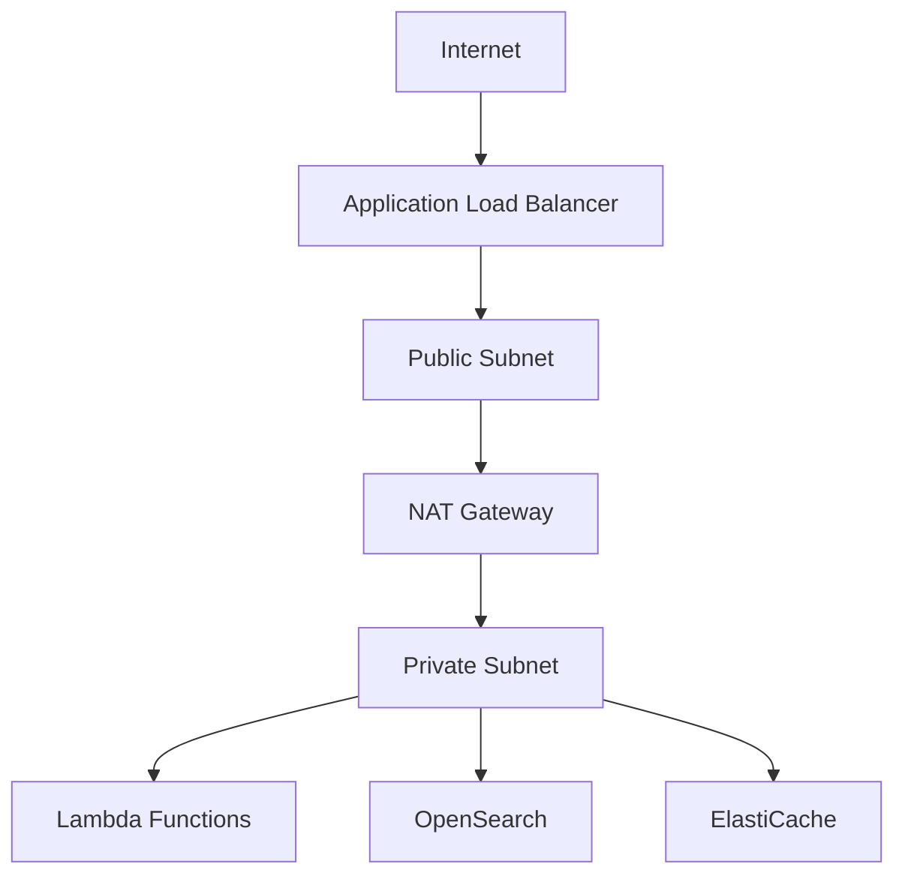
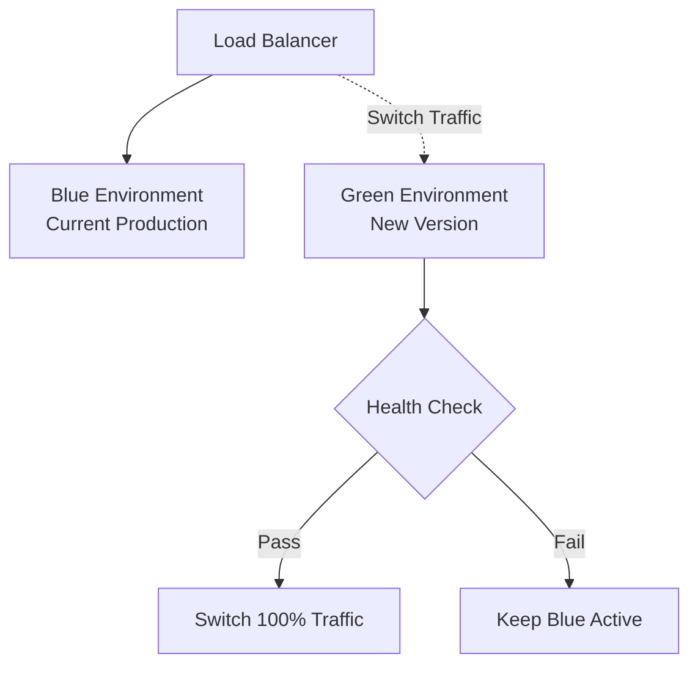

# System Design Document: KrishiMitra AI

## Overview

KrishiMitra AI is a serverless, AI-powered agricultural advisory platform built on AWS infrastructure. The system combines computer vision, natural language processing, and retrieval-augmented generation (RAG) to provide intelligent crop health diagnostics and actionable guidance to smallholder farmers in India.

The platform accepts two input modalities:
1. **Image-based**: Farmers upload crop photos for visual analysis
2. **Text-based**: Farmers describe symptoms in natural language

The system uses an agentic workflow orchestrated through AWS Lambda functions, where specialized agents handle different aspects of the diagnostic process: image analysis, knowledge retrieval, diagnosis generation, and multilingual output synthesis.

### Key Design Principles

- **Serverless-first**: Leverage AWS Lambda for automatic scaling and cost optimization
- **Modular architecture**: Separate concerns into distinct Lambda functions for maintainability
- **RAG-powered intelligence**: Combine retrieval with generation for accurate, contextual responses
- **Multilingual by design**: Support Indian regional languages throughout the pipeline
- **Cost-conscious**: Optimize for sub-₹2 per query operational cost
- **Resilient**: Implement fallback mechanisms and graceful degradation


## Architecture

### High-Level Architecture




### AWS Services Architecture

#### 1. API Gateway
- **Role**: Entry point for all client requests
- **Configuration**:
  - REST API with resource-based endpoints: `/diagnose/image`, `/diagnose/text`, `/audio/{id}`
  - Request validation and transformation
  - API key authentication for external clients
  - CORS enabled for web clients
  - Request throttling: 100 requests/hour per API key
  - Integration with Lambda via proxy integration

#### 2. AWS Lambda Functions

**Orchestrator Lambda** (`krishimitra-orchestrator`)
- **Runtime**: Python 3.11
- **Memory**: 512 MB
- **Timeout**: 30 seconds
- **Responsibilities**:
  - Route requests to appropriate agent functions
  - Manage workflow state in DynamoDB
  - Aggregate responses from multiple agents
  - Handle error recovery and retries

**Image Analysis Agent** (`krishimitra-image-agent`)
- **Runtime**: Python 3.11
- **Memory**: 1024 MB
- **Timeout**: 15 seconds
- **Responsibilities**:
  - Upload images to S3
  - Invoke Rekognition for feature extraction
  - Generate image embeddings using Bedrock Titan Embeddings
  - Return structured analysis results

**Text Processing Agent** (`krishimitra-text-agent`)
- **Runtime**: Python 3.11
- **Memory**: 512 MB
- **Timeout**: 10 seconds
- **Responsibilities**:
  - Validate and sanitize text input
  - Generate text embeddings using Bedrock Titan Embeddings
  - Extract crop type, symptoms, and region from text

**RAG Retrieval Agent** (`krishimitra-rag-agent`)
- **Runtime**: Python 3.11
- **Memory**: 1024 MB
- **Timeout**: 10 seconds
- **Responsibilities**:
  - Query vector database with embeddings
  - Filter results by region and crop type
  - Rank and select top-k relevant documents
  - Return context for LLM generation

**Diagnosis Generation Agent** (`krishimitra-diagnosis-agent`)
- **Runtime**: Python 3.11
- **Memory**: 2048 MB
- **Timeout**: 20 seconds
- **Responsibilities**:
  - Construct prompts with retrieved context
  - Invoke Bedrock LLM (Claude 3 Sonnet or Haiku)
  - Parse and structure LLM responses
  - Generate diagnosis, treatment, prevention, and economic impact

**TTS Generation Agent** (`krishimitra-tts-agent`)
- **Runtime**: Python 3.11
- **Memory**: 512 MB
- **Timeout**: 15 seconds
- **Responsibilities**:
  - Convert text to speech using Amazon Polly
  - Support multiple Indian language voices
  - Upload audio to S3 with presigned URLs
  - Return audio metadata and playback URL

#### 3. Amazon S3
- **Buckets**:
  - `krishimitra-images`: Store uploaded crop images
  - `krishimitra-audio`: Store generated TTS audio files
  - `krishimitra-knowledge`: Store agricultural knowledge documents
- **Configuration**:
  - Server-side encryption (SSE-S3)
  - Lifecycle policies: Archive images to Glacier after 90 days
  - Lifecycle policies: Delete audio files after 7 days
  - Versioning enabled for knowledge documents
  - CloudFront CDN for audio delivery

#### 4. Amazon Rekognition
- **Features Used**:
  - Custom Labels for crop disease detection (trained model)
  - Label Detection for general crop identification
  - Image Properties for quality assessment
- **Integration**: Invoked synchronously from Image Analysis Agent

#### 5. Amazon Bedrock
- **Models Used**:
  - **Titan Embeddings G1 - Text**: Generate text embeddings (1536 dimensions)
  - **Claude 3 Sonnet**: Primary LLM for diagnosis generation
  - **Claude 3 Haiku**: Fallback LLM for cost optimization
- **Configuration**:
  - Temperature: 0.3-0.5 for consistent outputs
  - Max tokens: 2000 for comprehensive responses
  - System prompts optimized for agricultural domain

#### 6. Vector Database (Pinecone or Amazon OpenSearch)
- **Choice**: Pinecone for managed service or OpenSearch Serverless for AWS-native
- **Configuration**:
  - Index dimension: 1536 (matching Titan Embeddings)
  - Metric: Cosine similarity
  - Metadata filters: region, crop_type, disease_category, language
  - Capacity: 100,000+ document embeddings
- **Data Structure**:
```json
{
  "id": "doc_12345",
  "values": [0.123, -0.456, ...],
  "metadata": {
    "crop_type": "rice",
    "disease": "blast",
    "region": "punjab",
    "language": "hi",
    "source": "ICAR",
    "confidence": 0.95
  }
}
```

#### 7. Amazon Polly
- **Voices Used**:
  - Hindi: Aditi (female), Kajal (female)
  - Tamil: Not native (use neural engine with transliteration)
  - Telugu, Kannada, Bengali, Marathi: Neural voices where available
- **Configuration**:
  - Output format: MP3
  - Sample rate: 22050 Hz
  - Neural engine for natural-sounding speech

#### 8. Amazon DynamoDB
- **Tables**:
  - `krishimitra-sessions`: Track user sessions and workflow state
  - `krishimitra-queries`: Store query history and feedback
  - `krishimitra-cache`: Cache frequent diagnoses
- **Schema** (`krishimitra-queries`):
```json
{
  "query_id": "uuid",
  "timestamp": "ISO8601",
  "user_id": "string",
  "input_type": "image|text",
  "crop_type": "string",
  "region": "string",
  "language": "string",
  "diagnosis": "string",
  "confidence": "number",
  "feedback": "number",
  "cost": "number"
}
```

#### 9. Amazon ElastiCache (Redis)
- **Purpose**: Cache frequent queries and responses
- **Configuration**:
  - Node type: cache.t3.micro (for MVP)
  - TTL: 24 hours for diagnoses, 7 days for knowledge chunks
  - Eviction policy: LRU (Least Recently Used)
- **Cache Keys**:
  - `diagnosis:{crop}:{symptoms_hash}`: Cached diagnoses
  - `rag:{embedding_hash}`: Cached RAG results


## Data Flow

### Image-Based Diagnosis Flow



### Text-Based Diagnosis Flow



### Data Flow Summary

1. **Input Reception**: API Gateway receives and validates requests
2. **Orchestration**: Orchestrator Lambda routes to appropriate agents
3. **Feature Extraction**: Image or text converted to embeddings
4. **Knowledge Retrieval**: RAG agent queries vector database
5. **Diagnosis Generation**: LLM synthesizes diagnosis with context
6. **Output Formatting**: Response structured in requested language
7. **Audio Generation**: Optional TTS conversion for voice output
8. **Response Delivery**: Complete advisory returned to user


## RAG (Retrieval-Augmented Generation) Architecture

### RAG Pipeline Overview

The RAG system enhances LLM responses with domain-specific agricultural knowledge, ensuring accurate and contextually relevant advice.



### Knowledge Base Structure

#### Document Sources
1. **Government Agricultural Departments**: ICAR, state agriculture departments
2. **Research Institutions**: Agricultural universities, research papers
3. **Extension Services**: Krishi Vigyan Kendras (KVKs) guidelines
4. **Farmer Success Stories**: Community-contributed solutions
5. **Pesticide Databases**: Approved treatments and application methods

#### Document Chunking Strategy
- **Chunk size**: 512 tokens with 50-token overlap
- **Chunking method**: Semantic chunking (preserve paragraph boundaries)
- **Metadata preservation**: Attach crop type, region, disease, source to each chunk

#### Embedding Generation
- **Model**: Amazon Bedrock Titan Embeddings G1 - Text
- **Dimension**: 1536
- **Batch processing**: Process 25 documents per batch
- **Update frequency**: Weekly for new knowledge, daily for corrections

### Retrieval Strategy

#### Stage 1: Vector Similarity Search
```python
# Pseudocode for retrieval
query_embedding = bedrock.embed(user_query)
results = vector_db.query(
    vector=query_embedding,
    filter={
        "crop_type": user_crop,
        "region": user_region
    },
    top_k=20,
    include_metadata=True
)
```

#### Stage 2: Metadata Filtering
- Filter by crop type (exact match)
- Filter by region (exact or neighboring regions)
- Filter by disease category (if detected from query)
- Filter by language (prefer native language documents)

#### Stage 3: Re-ranking
- **Method**: Cross-encoder re-ranking or BM25 hybrid
- **Criteria**:
  - Semantic relevance score (from vector search)
  - Recency of document (newer = higher weight)
  - Source credibility (government sources = higher weight)
  - User feedback score (if available)
- **Output**: Top-5 most relevant chunks

### Prompt Construction

#### System Prompt Template
```
You are KrishiMitra AI, an expert agricultural advisor for Indian farmers.
Your role is to provide accurate, practical, and region-specific crop health advice.

Guidelines:
- Base your diagnosis on the provided context documents
- Provide clear, actionable recommendations
- Consider local availability and cost of treatments
- Use simple language appropriate for farmers
- Include both organic and chemical treatment options
- Estimate economic impact when possible
- If uncertain, acknowledge limitations

Context Documents:
{retrieved_context}

User Query:
Crop: {crop_type}
Region: {region}
Symptoms: {symptoms}
Language: {language}
```

#### Response Format Instruction
```
Provide your response in {language} with the following structure:

1. DIAGNOSIS (निदान):
   - Disease/Condition name
   - Confidence level
   - Affected parts

2. TREATMENT (उपचार):
   - Immediate actions
   - Organic options
   - Chemical options (with dosage)
   - Application method

3. PREVENTION (रोकथाम):
   - Future prevention strategies
   - Best practices

4. ECONOMIC IMPACT (आर्थिक प्रभाव):
   - Potential yield loss if untreated
   - Estimated financial loss
   - Treatment cost estimate
   - Cost-benefit analysis
```

### RAG Optimization Techniques

#### 1. Hybrid Search
- Combine dense vector search with sparse keyword search (BM25)
- Weight: 70% vector similarity + 30% keyword match
- Improves recall for specific disease names and treatments

#### 2. Query Expansion
- Expand user query with synonyms and related terms
- Example: "पत्ते पीले हो रहे हैं" → ["yellowing leaves", "chlorosis", "nutrient deficiency"]

#### 3. Contextual Compression
- Compress retrieved documents to fit within LLM context window
- Extract only relevant sentences from each chunk
- Reduces token usage and improves focus

#### 4. Feedback Loop
- Collect user feedback on diagnosis accuracy
- Use feedback to fine-tune retrieval weights
- Update document rankings based on effectiveness


## Agentic Workflow

### Agent Architecture

KrishiMitra AI uses a multi-agent architecture where specialized agents handle distinct responsibilities, coordinated by an orchestrator agent.



### Agent Specifications

#### 1. Orchestrator Agent
**Responsibilities**:
- Receive and validate incoming requests
- Determine workflow path (image vs text)
- Coordinate agent execution sequence
- Aggregate results from multiple agents
- Handle error recovery and retries
- Manage state in DynamoDB

**Decision Logic**:
```python
# Pseudocode
if request.has_image:
    workflow = ["ImageAgent", "RAGAgent", "DiagnosisAgent"]
elif request.has_text:
    workflow = ["TextAgent", "RAGAgent", "DiagnosisAgent"]

if request.needs_audio:
    workflow.append("TTSAgent")

for agent in workflow:
    result = execute_agent(agent, context)
    context.update(result)
    if result.error:
        handle_error(agent, result.error)
```

**State Management**:
- Store workflow state in DynamoDB for fault tolerance
- Enable resume from last successful step on failure
- Track execution time and cost per agent

#### 2. Image Analysis Agent
**Responsibilities**:
- Upload image to S3 with unique identifier
- Invoke AWS Rekognition for visual analysis
- Extract crop type, disease symptoms, severity
- Generate image embeddings for similarity search
- Return structured analysis results

**Processing Pipeline**:
```python
# Pseudocode
def process_image(image_data, metadata):
    # Step 1: Upload to S3
    image_url = s3.upload(image_data, bucket="krishimitra-images")
    
    # Step 2: Rekognition analysis
    rekognition_result = rekognition.detect_custom_labels(
        image=image_url,
        model="crop-disease-detector-v1"
    )
    
    # Step 3: Generate embedding
    embedding = bedrock.embed_image(image_url)
    
    # Step 4: Structure results
    return {
        "image_url": image_url,
        "detected_labels": rekognition_result.labels,
        "confidence": rekognition_result.confidence,
        "embedding": embedding,
        "crop_type": extract_crop_type(rekognition_result),
        "symptoms": extract_symptoms(rekognition_result)
    }
```

#### 3. Text Processing Agent
**Responsibilities**:
- Validate and sanitize text input
- Extract entities (crop type, symptoms, region)
- Generate text embeddings
- Normalize multilingual input

**Entity Extraction**:
```python
# Pseudocode
def process_text(text, language):
    # Step 1: Sanitize input
    clean_text = sanitize(text)
    
    # Step 2: Extract entities using NER or LLM
    entities = bedrock.extract_entities(
        text=clean_text,
        language=language,
        entity_types=["crop", "symptom", "region", "severity"]
    )
    
    # Step 3: Generate embedding
    embedding = bedrock.embed_text(clean_text)
    
    return {
        "original_text": text,
        "entities": entities,
        "embedding": embedding,
        "crop_type": entities.get("crop"),
        "symptoms": entities.get("symptom")
    }
```

#### 4. RAG Retrieval Agent
**Responsibilities**:
- Query vector database with embeddings
- Apply metadata filters (crop, region, language)
- Re-rank results by relevance
- Return top-k context documents

**Retrieval Strategy**:
```python
# Pseudocode
def retrieve_context(embedding, filters, top_k=5):
    # Step 1: Vector similarity search
    candidates = vector_db.query(
        vector=embedding,
        filter=filters,
        top_k=top_k * 4  # Over-retrieve for re-ranking
    )
    
    # Step 2: Re-rank by multiple criteria
    ranked = rerank(
        candidates,
        criteria=["relevance", "recency", "source_credibility"]
    )
    
    # Step 3: Select top-k
    top_results = ranked[:top_k]
    
    # Step 4: Format context
    context = format_context(top_results)
    
    return {
        "context_documents": context,
        "sources": [doc.source for doc in top_results],
        "relevance_scores": [doc.score for doc in top_results]
    }
```

#### 5. Diagnosis Generation Agent
**Responsibilities**:
- Construct prompts with retrieved context
- Invoke Bedrock LLM with appropriate parameters
- Parse and structure LLM responses
- Validate output completeness
- Calculate economic impact estimates

**Generation Pipeline**:
```python
# Pseudocode
def generate_diagnosis(context, query, language):
    # Step 1: Construct prompt
    prompt = construct_prompt(
        system_prompt=AGRICULTURAL_ADVISOR_PROMPT,
        context=context.documents,
        query=query,
        language=language
    )
    
    # Step 2: Invoke LLM
    response = bedrock.invoke_model(
        model="anthropic.claude-3-sonnet",
        prompt=prompt,
        temperature=0.4,
        max_tokens=2000
    )
    
    # Step 3: Parse response
    structured = parse_response(response, expected_sections=[
        "diagnosis", "treatment", "prevention", "economic_impact"
    ])
    
    # Step 4: Validate completeness
    if not validate_response(structured):
        # Retry with more specific prompt
        structured = retry_generation(prompt, structured)
    
    # Step 5: Calculate economics
    structured["economic_impact"] = calculate_economics(
        crop=query.crop_type,
        disease=structured.diagnosis.disease,
        region=query.region
    )
    
    return structured
```

#### 6. TTS Generation Agent
**Responsibilities**:
- Convert text to speech using Amazon Polly
- Select appropriate voice for language
- Upload audio to S3
- Generate presigned URLs for playback

**Audio Generation**:
```python
# Pseudocode
def generate_audio(text, language):
    # Step 1: Select voice
    voice = select_voice(language)
    
    # Step 2: Generate speech
    audio_stream = polly.synthesize_speech(
        text=text,
        voice_id=voice,
        output_format="mp3",
        engine="neural"
    )
    
    # Step 3: Upload to S3
    audio_key = f"audio/{uuid.uuid4()}.mp3"
    s3.upload(audio_stream, bucket="krishimitra-audio", key=audio_key)
    
    # Step 4: Generate presigned URL (24-hour expiry)
    audio_url = s3.generate_presigned_url(
        bucket="krishimitra-audio",
        key=audio_key,
        expiration=86400
    )
    
    return {
        "audio_url": audio_url,
        "duration": calculate_duration(audio_stream),
        "language": language,
        "voice": voice
    }
```

### Agent Communication Protocol

**Message Format**:
```json
{
  "agent_id": "image-agent-001",
  "timestamp": "2024-01-15T10:30:00Z",
  "status": "success",
  "data": {
    "embedding": [...],
    "metadata": {...}
  },
  "error": null,
  "execution_time_ms": 1250,
  "cost_usd": 0.0015
}
```

**Error Handling**:
- Each agent returns standardized error codes
- Orchestrator implements retry logic with exponential backoff
- Failed agents trigger fallback mechanisms
- All errors logged to CloudWatch for monitoring


## Components and Interfaces

### API Endpoints

#### 1. Image Diagnosis Endpoint
```
POST /api/v1/diagnose/image
Content-Type: multipart/form-data

Request:
{
  "image": <binary>,
  "crop_type": "rice" | "wheat" | "cotton" | ...,
  "region": "punjab" | "tamil_nadu" | ...,
  "language": "hi" | "ta" | "te" | "kn" | "bn" | "mr",
  "include_audio": true | false,
  "user_id": "optional_user_identifier"
}

Response (200 OK):
{
  "query_id": "uuid",
  "diagnosis": {
    "disease": "Rice Blast",
    "confidence": 0.87,
    "affected_parts": ["leaves", "stems"],
    "severity": "moderate"
  },
  "treatment": {
    "immediate_actions": ["Isolate affected plants", "Remove infected leaves"],
    "organic_options": [
      {
        "name": "Neem oil spray",
        "dosage": "5ml per liter",
        "frequency": "Every 7 days",
        "cost_estimate": "₹200 per acre"
      }
    ],
    "chemical_options": [
      {
        "name": "Tricyclazole 75% WP",
        "dosage": "0.6g per liter",
        "frequency": "Two sprays at 10-day interval",
        "cost_estimate": "₹400 per acre"
      }
    ]
  },
  "prevention": {
    "strategies": ["Use resistant varieties", "Maintain proper spacing"],
    "best_practices": ["Avoid excessive nitrogen", "Ensure good drainage"]
  },
  "economic_impact": {
    "potential_yield_loss_percent": 25,
    "estimated_financial_loss": "₹15,000 per acre",
    "treatment_cost": "₹400-600 per acre",
    "cost_benefit_ratio": 25.0
  },
  "sources": ["ICAR-IIRR", "Punjab Agricultural University"],
  "audio_url": "https://s3.amazonaws.com/krishimitra-audio/...",
  "timestamp": "2024-01-15T10:30:00Z"
}
```

#### 2. Text Diagnosis Endpoint
```
POST /api/v1/diagnose/text
Content-Type: application/json

Request:
{
  "symptoms": "पत्तियों पर भूरे धब्बे दिख रहे हैं और पौधे मुरझा रहे हैं",
  "crop_type": "rice",
  "region": "uttar_pradesh",
  "language": "hi",
  "include_audio": true,
  "user_id": "optional_user_identifier"
}

Response: (Same structure as image diagnosis)
```

#### 3. Audio Retrieval Endpoint
```
GET /api/v1/audio/{query_id}

Response (200 OK):
{
  "audio_url": "https://s3.amazonaws.com/krishimitra-audio/...",
  "duration_seconds": 45,
  "language": "hi",
  "expires_at": "2024-01-16T10:30:00Z"
}
```

#### 4. Feedback Endpoint
```
POST /api/v1/feedback
Content-Type: application/json

Request:
{
  "query_id": "uuid",
  "rating": 4,
  "was_helpful": true,
  "comments": "Treatment worked well",
  "actual_disease": "optional_correction"
}

Response (200 OK):
{
  "message": "Feedback recorded successfully"
}
```

### Internal Component Interfaces

#### Lambda Function Interfaces

**Orchestrator Lambda**
```python
# Input Event
{
  "request_type": "image" | "text",
  "payload": {...},
  "user_context": {...}
}

# Output
{
  "status": "success" | "error",
  "diagnosis": {...},
  "execution_summary": {
    "total_time_ms": 4500,
    "agent_times": {...},
    "total_cost_usd": 0.0045
  }
}
```

**Image Analysis Agent**
```python
# Input
{
  "image_data": "base64_encoded_string",
  "metadata": {
    "crop_type": "rice",
    "region": "punjab"
  }
}

# Output
{
  "image_url": "s3://...",
  "embedding": [0.123, -0.456, ...],
  "visual_features": {
    "detected_crop": "rice",
    "detected_diseases": ["blast"],
    "confidence": 0.87
  }
}
```

**RAG Retrieval Agent**
```python
# Input
{
  "embedding": [0.123, -0.456, ...],
  "filters": {
    "crop_type": "rice",
    "region": "punjab"
  },
  "top_k": 5
}

# Output
{
  "documents": [
    {
      "content": "Rice blast is caused by...",
      "metadata": {...},
      "score": 0.92
    }
  ],
  "sources": ["ICAR", "PAU"]
}
```

### Data Models

#### Query Record
```python
class QueryRecord:
    query_id: str
    timestamp: datetime
    user_id: Optional[str]
    input_type: Literal["image", "text"]
    crop_type: str
    region: str
    language: str
    symptoms: str
    diagnosis: DiagnosisResult
    confidence: float
    execution_time_ms: int
    cost_usd: float
    feedback: Optional[FeedbackRecord]
```

#### Diagnosis Result
```python
class DiagnosisResult:
    disease: str
    confidence: float
    affected_parts: List[str]
    severity: Literal["mild", "moderate", "severe"]
    treatment: TreatmentPlan
    prevention: PreventionPlan
    economic_impact: EconomicImpact
    sources: List[str]
```

#### Treatment Plan
```python
class TreatmentPlan:
    immediate_actions: List[str]
    organic_options: List[TreatmentOption]
    chemical_options: List[TreatmentOption]
    
class TreatmentOption:
    name: str
    dosage: str
    frequency: str
    application_method: str
    cost_estimate: str
    availability: str
```

#### Economic Impact
```python
class EconomicImpact:
    potential_yield_loss_percent: float
    estimated_financial_loss: str
    treatment_cost_range: str
    cost_benefit_ratio: float
    roi_if_treated: float
```

### Vector Database Schema

```python
# Document structure in vector database
{
  "id": "doc_rice_blast_001",
  "values": [0.123, -0.456, ...],  # 1536-dimensional embedding
  "metadata": {
    "crop_type": "rice",
    "disease": "blast",
    "disease_category": "fungal",
    "region": "punjab",
    "language": "hi",
    "source": "ICAR-IIRR",
    "document_type": "treatment_guide",
    "last_updated": "2024-01-01",
    "credibility_score": 0.95,
    "usage_count": 1250
  },
  "sparse_values": {  # For hybrid search
    "indices": [12, 45, 89],
    "values": [0.5, 0.3, 0.2]
  }
}
```


## Scalability

### Horizontal Scaling Strategy

#### Lambda Auto-Scaling
- **Concurrency**: Reserved concurrency of 50 per function (adjustable)
- **Provisioned concurrency**: 5 instances for orchestrator during peak hours
- **Burst capacity**: Up to 1000 concurrent executions per region
- **Cold start mitigation**: Keep functions warm with CloudWatch Events (every 5 minutes)

#### Vector Database Scaling
**Pinecone Option**:
- Start with 1 pod (supports ~1M vectors)
- Scale to 2-4 pods as knowledge base grows
- Horizontal scaling for query throughput

**OpenSearch Serverless Option**:
- Auto-scales based on query load
- No manual capacity planning required
- Pay only for actual usage

#### S3 Scaling
- Automatically scales to handle any request volume
- Use S3 Transfer Acceleration for faster uploads from remote regions
- CloudFront CDN for audio file delivery (reduces latency)

#### DynamoDB Scaling
- On-demand capacity mode for unpredictable traffic
- Auto-scaling for provisioned capacity mode (if cost-optimized)
- Global tables for multi-region deployment (future)

### Performance Optimization

#### Caching Strategy


**Cache Layers**:
1. **L1 - ElastiCache Redis**: Frequently accessed diagnoses (TTL: 24 hours)
2. **L2 - DynamoDB**: Recent queries and results (TTL: 7 days)
3. **L3 - Full Pipeline**: Generate new diagnosis

**Cache Key Strategy**:
```python
# For text queries
cache_key = f"diagnosis:{crop}:{hash(symptoms)}:{region}:{language}"

# For image queries
cache_key = f"diagnosis:image:{image_hash}:{crop}:{region}:{language}"
```

#### Batch Processing
- **Embedding generation**: Batch up to 25 documents for knowledge base updates
- **Image processing**: Process multiple images in parallel using Step Functions
- **TTS generation**: Queue audio generation requests for async processing

#### Connection Pooling
- Reuse database connections across Lambda invocations
- Use AWS Lambda Layers for shared connection pools
- Implement connection warmup in Lambda initialization

### Load Distribution

#### Geographic Distribution
- Deploy Lambda functions in multiple AWS regions (Mumbai, Singapore)
- Use Route 53 latency-based routing for API Gateway
- Replicate S3 buckets across regions for faster access

#### Traffic Management
- API Gateway throttling: 100 requests/hour per API key (burst: 200)
- Rate limiting per user: 50 queries/day for free tier
- Priority queuing for premium users

### Monitoring and Auto-Scaling Triggers

**CloudWatch Alarms**:
- Lambda throttling > 5% → Increase reserved concurrency
- API Gateway 5xx errors > 1% → Alert operations team
- Average response time > 5 seconds → Scale up resources
- Vector DB query latency > 100ms → Add replicas

**Auto-Scaling Policies**:
```yaml
# Lambda concurrency scaling
- Metric: ConcurrentExecutions
  Threshold: 80% of reserved concurrency
  Action: Increase reserved concurrency by 20%

# DynamoDB scaling
- Metric: ConsumedReadCapacityUnits
  Threshold: 70% of provisioned capacity
  Action: Increase read capacity by 50%
```


## Security

### Authentication and Authorization

#### API Authentication


**Authentication Methods**:
1. **API Keys**: For third-party integrations
   - Generated via AWS API Gateway
   - Rotated every 90 days
   - Rate-limited per key

2. **JWT Tokens**: For mobile/web apps
   - Issued by Amazon Cognito
   - Short-lived access tokens (1 hour)
   - Refresh tokens (30 days)

3. **IAM Roles**: For internal AWS service communication
   - Least-privilege principle
   - Service-to-service authentication

#### Authorization Model
```python
# Role-based access control
Roles:
  - Free User: 50 queries/day, no priority support
  - Premium User: Unlimited queries, priority processing
  - Partner: API access, bulk processing
  - Admin: Full system access, analytics dashboard
```

### Data Encryption

#### Encryption at Rest
- **S3**: Server-side encryption (SSE-S3) with AES-256
- **DynamoDB**: Encryption at rest using AWS-managed keys
- **ElastiCache**: Encryption at rest enabled
- **Vector Database**: Encryption enabled (Pinecone/OpenSearch)

#### Encryption in Transit
- **API Gateway**: TLS 1.2+ enforced
- **Lambda to AWS Services**: HTTPS/TLS for all connections
- **Client to API**: HTTPS only, HTTP redirects to HTTPS

#### Key Management
- **AWS KMS**: Manage encryption keys
- **Key rotation**: Automatic annual rotation
- **Separate keys**: Different keys for different data types (images, audio, metadata)

### IAM Policies and Roles

#### Lambda Execution Roles
```json
{
  "Version": "2012-10-17",
  "Statement": [
    {
      "Effect": "Allow",
      "Action": [
        "s3:GetObject",
        "s3:PutObject"
      ],
      "Resource": "arn:aws:s3:::krishimitra-images/*"
    },
    {
      "Effect": "Allow",
      "Action": [
        "bedrock:InvokeModel"
      ],
      "Resource": "arn:aws:bedrock:*:*:model/*"
    },
    {
      "Effect": "Allow",
      "Action": [
        "rekognition:DetectLabels",
        "rekognition:DetectCustomLabels"
      ],
      "Resource": "*"
    },
    {
      "Effect": "Allow",
      "Action": [
        "dynamodb:GetItem",
        "dynamodb:PutItem",
        "dynamodb:Query"
      ],
      "Resource": "arn:aws:dynamodb:*:*:table/krishimitra-*"
    }
  ]
}
```

#### S3 Bucket Policies
```json
{
  "Version": "2012-10-17",
  "Statement": [
    {
      "Effect": "Deny",
      "Principal": "*",
      "Action": "s3:*",
      "Resource": "arn:aws:s3:::krishimitra-images/*",
      "Condition": {
        "Bool": {
          "aws:SecureTransport": "false"
        }
      }
    }
  ]
}
```

### Data Privacy and Compliance

#### Personal Data Handling
- **Minimal collection**: Only collect necessary data (crop type, region, symptoms)
- **No PII storage**: Avoid storing farmer names, phone numbers, addresses
- **Anonymization**: Hash user identifiers before storage
- **Data retention**: Delete images after 90 days, queries after 1 year

#### Compliance Requirements
- **Indian IT Act 2000**: Comply with data protection provisions
- **GDPR considerations**: For international users (if applicable)
- **Right to deletion**: Implement data deletion API
- **Data portability**: Allow users to export their query history

#### Audit Logging
- **CloudTrail**: Log all API calls and AWS service interactions
- **CloudWatch Logs**: Log all Lambda executions with request/response
- **Retention**: 1 year for audit logs, 90 days for operational logs

### Network Security

#### VPC Configuration


**VPC Setup** (for OpenSearch/ElastiCache):
- Lambda functions in private subnets
- NAT Gateway for outbound internet access
- Security groups restrict inbound traffic
- VPC endpoints for AWS services (S3, DynamoDB, Bedrock)

#### Security Groups
```yaml
Lambda Security Group:
  Inbound: None (Lambda initiated)
  Outbound: 
    - HTTPS (443) to AWS services
    - Custom ports to OpenSearch/ElastiCache

OpenSearch Security Group:
  Inbound:
    - Port 443 from Lambda security group
  Outbound: None

ElastiCache Security Group:
  Inbound:
    - Port 6379 from Lambda security group
  Outbound: None
```

### Vulnerability Management

#### Security Best Practices
- **Dependency scanning**: Scan Lambda dependencies for vulnerabilities (Snyk, AWS Inspector)
- **Code scanning**: Static analysis for security issues (SonarQube, Bandit)
- **Secrets management**: Store API keys in AWS Secrets Manager
- **Input validation**: Sanitize all user inputs to prevent injection attacks
- **Rate limiting**: Prevent DDoS and abuse

#### Incident Response
- **Monitoring**: CloudWatch alarms for suspicious activity
- **Alerting**: SNS notifications for security events
- **Runbooks**: Documented procedures for common security incidents
- **Backup**: Regular backups of DynamoDB and vector database


## Cost Optimization

### Cost Breakdown (Per Query)

| Component | Cost per Query | Notes |
|-----------|---------------|-------|
| API Gateway | ₹0.0003 | $0.0000035 per request |
| Lambda (Orchestrator) | ₹0.02 | 512MB, 2s execution |
| Lambda (Image Agent) | ₹0.05 | 1024MB, 3s execution |
| Lambda (RAG Agent) | ₹0.03 | 1024MB, 2s execution |
| Lambda (Diagnosis Agent) | ₹0.08 | 2048MB, 5s execution |
| Lambda (TTS Agent) | ₹0.02 | 512MB, 3s execution (if used) |
| S3 (Image Storage) | ₹0.002 | 2MB image, 90-day retention |
| S3 (Audio Storage) | ₹0.001 | 500KB audio, 7-day retention |
| Rekognition | ₹0.10 | Custom labels detection |
| Bedrock (Embeddings) | ₹0.01 | Titan Embeddings |
| Bedrock (LLM) | ₹0.50 | Claude 3 Sonnet, 2000 tokens |
| Vector DB (Pinecone) | ₹0.05 | Query + storage amortized |
| DynamoDB | ₹0.005 | On-demand pricing |
| ElastiCache | ₹0.01 | Amortized hourly cost |
| **Total (with image)** | **₹0.90** | **~$0.011 USD** |
| **Total (text only)** | **₹0.73** | **~$0.009 USD** |

**Target**: Keep cost under ₹2 per query (achieved ✓)

### Cost Optimization Strategies

#### 1. Caching
**Impact**: Reduce 60-70% of queries through caching
```python
# Cache hit rate optimization
- Common diagnoses cached for 24 hours
- Regional knowledge cached for 7 days
- Estimated cache hit rate: 65%
- Cost savings: ₹0.60 per cached query
```

#### 2. Model Selection
**Strategy**: Use cheaper models when appropriate
```python
# Model tiering
if query_complexity == "simple":
    model = "claude-3-haiku"  # 5x cheaper than Sonnet
    cost_per_query = ₹0.10
elif query_complexity == "moderate":
    model = "claude-3-sonnet"
    cost_per_query = ₹0.50
else:
    model = "claude-3-opus"  # Premium queries only
    cost_per_query = ₹1.50
```

#### 3. Batch Processing
**Strategy**: Batch knowledge base updates
```python
# Instead of processing documents one-by-one
# Batch 25 documents per embedding API call
cost_per_document = ₹0.01 / 25 = ₹0.0004
savings = 96% on knowledge base updates
```

#### 4. Lambda Optimization
**Memory vs Cost Trade-off**:
```python
# Right-size Lambda memory
- Orchestrator: 512MB (not 1024MB) → 50% cost reduction
- Use ARM64 (Graviton2) → 20% cost reduction
- Reduce timeout to minimum required → Prevent runaway costs
```

#### 5. Storage Lifecycle Policies
```yaml
S3 Lifecycle Rules:
  Images:
    - After 30 days: Move to S3 Intelligent-Tiering
    - After 90 days: Move to Glacier
    - After 1 year: Delete
  
  Audio:
    - After 7 days: Delete
  
  Savings: 80% on storage costs
```

#### 6. Vector Database Optimization
**Pinecone**:
- Use p1 pods (cheaper) for MVP
- Scale to p2 pods only when needed
- Implement query result caching

**OpenSearch Serverless**:
- Pay only for actual usage
- No idle capacity costs
- Auto-scales down during low traffic

#### 7. Reserved Capacity
**For predictable workloads**:
```yaml
Reserved Instances:
  - ElastiCache: 1-year reserved → 30% savings
  - DynamoDB: Provisioned capacity → 50% savings vs on-demand
  
Applicable when: >10,000 queries/day consistently
```

#### 8. Request Optimization
**Reduce token usage**:
```python
# Compress context before sending to LLM
- Remove redundant information
- Summarize long documents
- Use bullet points instead of paragraphs
- Token reduction: 30-40%
- Cost savings: ₹0.15 per query
```

### Cost Monitoring and Alerts

#### CloudWatch Cost Alarms
```yaml
Alarms:
  - Average cost per query > ₹2.50
  - Daily spend > ₹10,000
  - Bedrock API costs > ₹5,000/day
  - S3 storage > 1TB
  
Actions:
  - Send SNS notification
  - Trigger Lambda to analyze cost spike
  - Auto-scale down if necessary
```

#### Cost Attribution
```python
# Tag all resources for cost tracking
Tags:
  - Project: KrishiMitra
  - Environment: Production
  - Component: ImageAgent | RAGAgent | etc.
  - CostCenter: Engineering
```

### Pricing Tiers for Users

#### Free Tier
- 50 queries/day
- Standard processing (Claude Haiku)
- No priority support
- Cost to platform: ₹0.73 per query
- Revenue: ₹0 (subsidized by premium users)

#### Premium Tier (₹299/month)
- Unlimited queries
- Fast processing (Claude Sonnet)
- Priority support
- Audio output included
- Cost to platform: ₹0.90 per query
- Break-even: ~400 queries/month

#### Enterprise Tier (Custom pricing)
- API access
- Bulk processing
- Custom model fine-tuning
- Dedicated support
- SLA guarantees


## Deployment Strategy

### Infrastructure as Code

#### AWS CDK Stack Structure
```python
# cdk_app.py
from aws_cdk import App, Stack
from constructs import Construct

class KrishiMitraStack(Stack):
    def __init__(self, scope: Construct, id: str, **kwargs):
        super().__init__(scope, id, **kwargs)
        
        # VPC and Networking
        self.vpc = self.create_vpc()
        
        # Storage Layer
        self.s3_buckets = self.create_s3_buckets()
        self.dynamodb_tables = self.create_dynamodb_tables()
        
        # Compute Layer
        self.lambda_functions = self.create_lambda_functions()
        
        # API Layer
        self.api_gateway = self.create_api_gateway()
        
        # AI Services
        self.setup_bedrock_access()
        self.setup_rekognition()
        
        # Monitoring
        self.setup_monitoring()
```

#### Terraform Alternative
```hcl
# main.tf
module "api_gateway" {
  source = "./modules/api_gateway"
  stage  = var.environment
}

module "lambda_functions" {
  source = "./modules/lambda"
  vpc_id = module.vpc.vpc_id
}

module "storage" {
  source = "./modules/storage"
  environment = var.environment
}
```

### CI/CD Pipeline

```mermaid
graph LR
    Dev[Developer] --> Git[GitHub/GitLab]
    Git --> CI[CI Pipeline]
    CI --> Build[Build & Test]
    Build --> Scan[Security Scan]
    Scan --> Package[Package Lambda]
    Package --> Deploy[Deploy to Dev]
    Deploy --> Test[Integration Tests]
    Test --> Staging[Deploy to Staging]
    Staging --> Approval[Manual Approval]
    Approval --> Prod[Deploy to Production]
```



#### GitHub Actions Workflow
```yaml
# .github/workflows/deploy.yml
name: Deploy KrishiMitra

on:
  push:
    branches: [main, develop]

jobs:
  test:
    runs-on: ubuntu-latest
    steps:
      - uses: actions/checkout@v3
      - name: Run unit tests
        run: pytest tests/
      - name: Run integration tests
        run: pytest tests/integration/
  
  security-scan:
    runs-on: ubuntu-latest
    steps:
      - name: Run Bandit security scan
        run: bandit -r src/
      - name: Scan dependencies
        run: safety check
  
  deploy-dev:
    needs: [test, security-scan]
    if: github.ref == 'refs/heads/develop'
    runs-on: ubuntu-latest
    steps:
      - name: Configure AWS credentials
        uses: aws-actions/configure-aws-credentials@v2
      - name: Deploy to Dev
        run: |
          cdk deploy KrishiMitraStack-Dev --require-approval never
  
  deploy-prod:
    needs: [test, security-scan]
    if: github.ref == 'refs/heads/main'
    runs-on: ubuntu-latest
    steps:
      - name: Deploy to Production
        run: |
          cdk deploy KrishiMitraStack-Prod --require-approval never
```

### Environment Strategy

#### Multi-Environment Setup
```yaml
Environments:
  Development:
    Purpose: Active development and testing
    Resources: Minimal (single Lambda, small cache)
    Data: Synthetic test data
    Cost: ~₹500/month
  
  Staging:
    Purpose: Pre-production validation
    Resources: Production-like (scaled down 50%)
    Data: Anonymized production data
    Cost: ~₹2,000/month
  
  Production:
    Purpose: Live user traffic
    Resources: Full scale with auto-scaling
    Data: Real user data
    Cost: Variable (₹10,000-50,000/month)
```

#### Configuration Management
```python
# config.py
import os

class Config:
    ENVIRONMENT = os.getenv("ENVIRONMENT", "dev")
    
    # AWS Resources
    S3_IMAGES_BUCKET = f"krishimitra-images-{ENVIRONMENT}"
    S3_AUDIO_BUCKET = f"krishimitra-audio-{ENVIRONMENT}"
    
    # Bedrock Configuration
    BEDROCK_MODEL = {
        "dev": "anthropic.claude-3-haiku",
        "staging": "anthropic.claude-3-sonnet",
        "prod": "anthropic.claude-3-sonnet"
    }[ENVIRONMENT]
    
    # Rate Limits
    RATE_LIMIT = {
        "dev": 1000,
        "staging": 500,
        "prod": 100
    }[ENVIRONMENT]
```

### Deployment Process

#### Blue-Green Deployment


**Steps**:
1. Deploy new version to Green environment
2. Run smoke tests on Green
3. Route 10% traffic to Green (canary)
4. Monitor metrics for 30 minutes
5. If healthy, route 100% traffic to Green
6. Keep Blue for 24 hours (quick rollback)
7. Decommission Blue after validation

#### Lambda Versioning and Aliases
```python
# Lambda version management
Versions:
  - $LATEST: Development version
  - v1, v2, v3: Immutable versions
  
Aliases:
  - dev → $LATEST
  - staging → v3
  - prod → v2 (90% traffic) + v3 (10% traffic)
```

### Rollback Strategy

#### Automated Rollback Triggers
```yaml
Rollback Conditions:
  - Error rate > 5% for 5 minutes
  - Average latency > 10 seconds
  - Bedrock API errors > 10%
  - User-reported critical bugs > 10

Rollback Actions:
  1. Switch API Gateway to previous Lambda alias
  2. Revert DynamoDB table to previous backup
  3. Restore S3 bucket to previous version
  4. Send alert to operations team
```

#### Manual Rollback Procedure
```bash
# Rollback script
#!/bin/bash
PREVIOUS_VERSION="v2"
ENVIRONMENT="prod"

# Update Lambda alias
aws lambda update-alias \
  --function-name krishimitra-orchestrator \
  --name $ENVIRONMENT \
  --function-version $PREVIOUS_VERSION

# Update API Gateway stage
aws apigateway update-stage \
  --rest-api-id $API_ID \
  --stage-name $ENVIRONMENT \
  --patch-operations op=replace,path=/variables/lambdaAlias,value=$PREVIOUS_VERSION
```

### Monitoring and Observability

#### CloudWatch Dashboards
```yaml
Dashboard: KrishiMitra Production
Widgets:
  - API Gateway Requests (per minute)
  - Lambda Invocations (per function)
  - Error Rate (%)
  - Average Latency (ms)
  - Bedrock API Calls
  - Cost per Query (₹)
  - Cache Hit Rate (%)
  - User Satisfaction Score
```

#### Distributed Tracing
```python
# AWS X-Ray integration
import aws_xray_sdk
from aws_xray_sdk.core import xray_recorder

@xray_recorder.capture('orchestrator')
def lambda_handler(event, context):
    # Trace entire request flow
    with xray_recorder.capture('image_processing'):
        process_image(event)
    
    with xray_recorder.capture('rag_retrieval'):
        retrieve_context(event)
    
    with xray_recorder.capture('diagnosis_generation'):
        generate_diagnosis(event)
```

#### Logging Strategy
```python
# Structured logging
import json
import logging

logger = logging.getLogger()
logger.setLevel(logging.INFO)

def log_event(event_type, data):
    log_entry = {
        "timestamp": datetime.utcnow().isoformat(),
        "event_type": event_type,
        "environment": os.getenv("ENVIRONMENT"),
        "data": data
    }
    logger.info(json.dumps(log_entry))

# Usage
log_event("diagnosis_generated", {
    "query_id": query_id,
    "crop_type": crop,
    "confidence": confidence,
    "execution_time_ms": execution_time
})
```

### Disaster Recovery

#### Backup Strategy
```yaml
Backups:
  DynamoDB:
    - Point-in-time recovery enabled
    - Daily snapshots retained for 30 days
    - Cross-region replication to Singapore
  
  S3:
    - Versioning enabled
    - Cross-region replication for critical data
    - Lifecycle policies for cost optimization
  
  Vector Database:
    - Daily snapshots
    - Stored in S3 for long-term retention
    - Automated restore scripts
```

#### Recovery Time Objectives
```yaml
RTO (Recovery Time Objective):
  - Critical services: 1 hour
  - Non-critical services: 4 hours

RPO (Recovery Point Objective):
  - User data: 1 hour (DynamoDB PITR)
  - Knowledge base: 24 hours (daily backups)
```


## Correctness Properties

A property is a characteristic or behavior that should hold true across all valid executions of a system—essentially, a formal statement about what the system should do. Properties serve as the bridge between human-readable specifications and machine-verifiable correctness guarantees.

### Input Validation Properties

Property 1: Image format and size validation
*For any* uploaded file, if it is a valid JPEG, PNG, or HEIC image under 10MB, the system should accept it; otherwise, it should reject it with a descriptive error message in the user's selected language
**Validates: Requirements 1.1, 1.5**

Property 2: Text input length validation
*For any* symptom description, if it contains at least 10 characters, the system should accept it; otherwise, it should prompt for more specific details
**Validates: Requirements 2.2, 2.4**

Property 3: Multilingual text acceptance
*For any* text input in a supported regional language (Hindi, Tamil, Telugu, Kannada, Bengali, Marathi), the system should successfully process it
**Validates: Requirements 2.1**

### Storage and Persistence Properties

Property 4: Image storage with encryption
*For any* accepted crop image, the system should store it in S3 with AES-256 encryption and return a valid S3 URL
**Validates: Requirements 1.2, 11.1**

Property 5: Audio storage with expiring URLs
*For any* generated audio file, the system should store it in S3 and provide a presigned URL that is valid for 24 hours
**Validates: Requirements 8.4**

### Feature Extraction Properties

Property 6: Image embedding generation
*For any* stored crop image, the system should invoke Rekognition and generate a 1536-dimensional embedding vector
**Validates: Requirements 1.3, 1.4**

Property 7: Text embedding generation
*For any* validated symptom description, the system should generate a 1536-dimensional embedding vector
**Validates: Requirements 2.3**

### RAG Retrieval Properties

Property 8: Top-K document retrieval
*For any* query embedding, the RAG system should retrieve exactly 5 documents ranked by semantic similarity
**Validates: Requirements 3.1**

Property 9: Metadata filtering
*For any* retrieval query with specified crop type and region filters, all returned documents should match those filter criteria
**Validates: Requirements 3.2**

Property 10: Region fallback behavior
*For any* query without region information, the system should either extract region from API request metadata or prompt the user
**Validates: Requirements 3.3**

### Diagnosis Generation Properties

Property 11: Context-based diagnosis
*For any* set of retrieved documents, the LLM should generate a diagnosis that references information from the provided context
**Validates: Requirements 4.1**

Property 12: Diagnosis completeness
*For any* generated diagnosis, it should include disease name, confidence level, and affected crop parts
**Validates: Requirements 4.2**

Property 13: LLM temperature configuration
*For any* diagnosis generation request, the Bedrock API call should use a temperature between 0.3 and 0.5
**Validates: Requirements 4.3**

Property 14: Low confidence handling
*For any* diagnosis with confidence below 60%, the system should indicate uncertainty and suggest consulting an expert
**Validates: Requirements 4.5**

### Treatment and Advisory Properties

Property 15: Treatment option completeness
*For any* generated diagnosis, the treatment recommendations should include both organic and chemical options
**Validates: Requirements 5.1**

Property 16: Advisory structure completeness
*For any* generated advisory, it should include prevention strategies, application methods, dosages, and timing
**Validates: Requirements 5.2, 5.3**

Property 17: Treatment ranking
*For any* advisory with multiple treatment options, the treatments should be ranked with effectiveness and cost scores
**Validates: Requirements 5.5**

### Economic Impact Properties

Property 18: Economic impact completeness
*For any* generated diagnosis, the economic impact should include yield loss percentage, financial loss estimate, treatment cost, and cost-benefit ratio
**Validates: Requirements 6.1, 6.2, 6.3, 6.4**

Property 19: Price fallback mechanism
*For any* economic calculation when market price data is unavailable, the system should use regional average prices from the past 6 months
**Validates: Requirements 6.5**

### Multilingual Output Properties

Property 20: Language support coverage
*For any* diagnosis request specifying Hindi, Tamil, Telugu, Kannada, Bengali, or Marathi, the system should generate output in that language
**Validates: Requirements 7.1, 7.2**

### Text-to-Speech Properties

Property 21: TTS generation for all languages
*For any* advisory text in a supported regional language, when audio is requested, the system should generate MP3 audio using the appropriate voice
**Validates: Requirements 8.1, 8.2**

### API and Integration Properties

Property 22: Authentication enforcement
*For any* API request without valid authentication (API key or JWT token), the system should reject it with a 401 Unauthorized error
**Validates: Requirements 9.2**

Property 23: Endpoint routing
*For any* API request to /diagnose/image, /diagnose/text, or /audio/{id}, the system should route it to the correct Lambda function
**Validates: Requirements 9.3**

Property 24: JSON response format
*For any* API response (success or error), it should be valid JSON with standardized error codes
**Validates: Requirements 9.4**

Property 25: Rate limiting enforcement
*For any* API key, when requests exceed 100 per hour, the system should return a 429 Too Many Requests error
**Validates: Requirements 9.6**

### Caching Properties

Property 26: Cache hit for repeated queries
*For any* diagnosis query that has been processed before, when queried again within 24 hours, the system should return the cached result without invoking the LLM
**Validates: Requirements 10.5**

Property 27: Cache fallback on database failure
*For any* common query, when the vector database is unreachable, the system should return cached results if available
**Validates: Requirements 12.3**

### Privacy and Security Properties

Property 28: PII exclusion
*For any* stored query record, it should not contain personally identifiable information (names, phone numbers, addresses) unless explicit consent was provided
**Validates: Requirements 11.3**

Property 29: Data deletion completeness
*For any* user data deletion request, all associated images, query history, and audio files should be removed within 48 hours
**Validates: Requirements 11.4**

### Error Handling Properties

Property 30: Retry mechanism
*For any* AWS service failure, the system should retry the operation up to 3 times with exponential backoff before returning an error
**Validates: Requirements 12.1**

Property 31: LLM fallback
*For any* LLM generation failure, the system should fall back to template-based responses using the retrieved documents
**Validates: Requirements 12.2**

Property 32: Error logging
*For any* error that occurs during processing, the system should log it to CloudWatch with timestamp, error type, and context
**Validates: Requirements 12.4**

Property 33: Error reference ID
*For any* error response returned to the user, it should include a unique reference ID for support inquiries
**Validates: Requirements 12.5**

### Monitoring and Analytics Properties

Property 34: Request logging completeness
*For any* API request, the system should log it with timestamp, response time, status code, and user context
**Validates: Requirements 13.1**

Property 35: Feedback collection
*For any* diagnosis, when user feedback is provided, the system should store it with the query ID and rating
**Validates: Requirements 13.2**

Property 36: Cost tracking
*For any* processed query, the system should calculate and log the total cost including all AWS service charges
**Validates: Requirements 13.4**

Property 37: Usage analytics aggregation
*For any* 24-hour period, the system should generate a usage report aggregating query volume by language, region, and crop type
**Validates: Requirements 13.5**


## Error Handling

### Error Categories

#### 1. Input Validation Errors
```python
class ValidationError(Exception):
    """Raised when user input fails validation"""
    
    error_codes = {
        "INVALID_IMAGE_FORMAT": {
            "code": "VAL_001",
            "message": "Image must be JPEG, PNG, or HEIC format",
            "http_status": 400
        },
        "IMAGE_TOO_LARGE": {
            "code": "VAL_002",
            "message": "Image size must not exceed 10MB",
            "http_status": 400
        },
        "TEXT_TOO_SHORT": {
            "code": "VAL_003",
            "message": "Symptom description must be at least 10 characters",
            "http_status": 400
        },
        "UNSUPPORTED_LANGUAGE": {
            "code": "VAL_004",
            "message": "Language not supported. Choose from: hi, ta, te, kn, bn, mr",
            "http_status": 400
        }
    }
```

#### 2. Service Integration Errors
```python
class ServiceError(Exception):
    """Raised when AWS service calls fail"""
    
    error_codes = {
        "S3_UPLOAD_FAILED": {
            "code": "SVC_001",
            "message": "Failed to upload image to storage",
            "http_status": 503,
            "retry": True
        },
        "REKOGNITION_FAILED": {
            "code": "SVC_002",
            "message": "Image analysis service unavailable",
            "http_status": 503,
            "retry": True
        },
        "BEDROCK_UNAVAILABLE": {
            "code": "SVC_003",
            "message": "AI service temporarily unavailable",
            "http_status": 503,
            "retry": True
        },
        "VECTOR_DB_TIMEOUT": {
            "code": "SVC_004",
            "message": "Knowledge retrieval timed out",
            "http_status": 504,
            "retry": True
        }
    }
```

#### 3. Business Logic Errors
```python
class BusinessError(Exception):
    """Raised when business rules are violated"""
    
    error_codes = {
        "LOW_CONFIDENCE_DIAGNOSIS": {
            "code": "BIZ_001",
            "message": "Unable to diagnose with confidence. Please consult an expert.",
            "http_status": 200,  # Not an error, but low confidence
            "retry": False
        },
        "NO_RELEVANT_KNOWLEDGE": {
            "code": "BIZ_002",
            "message": "No relevant information found for this crop and region",
            "http_status": 404,
            "retry": False
        },
        "RATE_LIMIT_EXCEEDED": {
            "code": "BIZ_003",
            "message": "Query limit exceeded. Please try again later.",
            "http_status": 429,
            "retry": False
        }
    }
```

#### 4. System Errors
```python
class SystemError(Exception):
    """Raised for unexpected system failures"""
    
    error_codes = {
        "INTERNAL_ERROR": {
            "code": "SYS_001",
            "message": "An unexpected error occurred. Please try again.",
            "http_status": 500,
            "retry": True
        },
        "TIMEOUT": {
            "code": "SYS_002",
            "message": "Request timed out. Please try again.",
            "http_status": 504,
            "retry": True
        }
    }
```

### Error Handling Strategy

#### Retry Logic with Exponential Backoff
```python
def retry_with_backoff(func, max_retries=3, base_delay=1):
    """
    Retry function with exponential backoff
    """
    for attempt in range(max_retries):
        try:
            return func()
        except RetryableError as e:
            if attempt == max_retries - 1:
                raise
            
            delay = base_delay * (2 ** attempt)
            time.sleep(delay)
            logger.warning(f"Retry attempt {attempt + 1} after {delay}s: {e}")
    
    raise MaxRetriesExceeded()
```

#### Circuit Breaker Pattern
```python
class CircuitBreaker:
    """
    Prevent cascading failures by stopping calls to failing services
    """
    def __init__(self, failure_threshold=5, timeout=60):
        self.failure_count = 0
        self.failure_threshold = failure_threshold
        self.timeout = timeout
        self.last_failure_time = None
        self.state = "CLOSED"  # CLOSED, OPEN, HALF_OPEN
    
    def call(self, func):
        if self.state == "OPEN":
            if time.time() - self.last_failure_time > self.timeout:
                self.state = "HALF_OPEN"
            else:
                raise CircuitBreakerOpen("Service temporarily unavailable")
        
        try:
            result = func()
            if self.state == "HALF_OPEN":
                self.state = "CLOSED"
                self.failure_count = 0
            return result
        except Exception as e:
            self.failure_count += 1
            self.last_failure_time = time.time()
            
            if self.failure_count >= self.failure_threshold:
                self.state = "OPEN"
            
            raise
```

### Fallback Mechanisms

#### 1. LLM Fallback
```python
def generate_diagnosis_with_fallback(context, query):
    """
    Try primary LLM, fall back to cheaper model, then templates
    """
    try:
        # Try Claude 3 Sonnet
        return bedrock.invoke_model("claude-3-sonnet", context, query)
    except BedrockError:
        try:
            # Fall back to Claude 3 Haiku
            return bedrock.invoke_model("claude-3-haiku", context, query)
        except BedrockError:
            # Fall back to template-based response
            return generate_template_response(context, query)
```

#### 2. Cache Fallback
```python
def retrieve_with_fallback(query_embedding, filters):
    """
    Try vector DB, fall back to cache, then error
    """
    try:
        return vector_db.query(query_embedding, filters)
    except VectorDBError:
        cached = cache.get(f"rag:{hash(query_embedding)}")
        if cached:
            logger.warning("Vector DB unavailable, using cached results")
            return cached
        raise NoKnowledgeAvailable()
```

#### 3. Price Data Fallback
```python
def get_market_price(crop, region):
    """
    Try current prices, fall back to historical averages
    """
    try:
        return market_api.get_current_price(crop, region)
    except MarketAPIError:
        return get_historical_average(crop, region, months=6)
```

### Error Response Format

```json
{
  "success": false,
  "error": {
    "code": "SVC_003",
    "message": "AI service temporarily unavailable",
    "message_localized": "एआई सेवा अस्थायी रूप से अनुपलब्ध है",
    "reference_id": "err_20240115_abc123",
    "timestamp": "2024-01-15T10:30:00Z",
    "retry_after": 60,
    "support_contact": "support@krishimitra.ai"
  },
  "request_id": "req_xyz789"
}
```

### Graceful Degradation

#### Partial Response Strategy
```python
def generate_advisory(diagnosis, context):
    """
    Return partial results if some components fail
    """
    response = {
        "diagnosis": diagnosis,
        "treatment": None,
        "prevention": None,
        "economic_impact": None,
        "warnings": []
    }
    
    try:
        response["treatment"] = generate_treatment(diagnosis, context)
    except Exception as e:
        response["warnings"].append("Treatment recommendations unavailable")
        logger.error(f"Treatment generation failed: {e}")
    
    try:
        response["prevention"] = generate_prevention(diagnosis, context)
    except Exception as e:
        response["warnings"].append("Prevention strategies unavailable")
        logger.error(f"Prevention generation failed: {e}")
    
    try:
        response["economic_impact"] = calculate_economics(diagnosis)
    except Exception as e:
        response["warnings"].append("Economic impact unavailable")
        logger.error(f"Economics calculation failed: {e}")
    
    return response
```


## Testing Strategy

### Dual Testing Approach

KrishiMitra AI requires both unit testing and property-based testing to ensure comprehensive coverage. Unit tests validate specific examples and edge cases, while property-based tests verify universal properties across all inputs. Together, they provide confidence in system correctness.

### Property-Based Testing

#### Framework Selection
- **Python**: Use `hypothesis` library for property-based testing
- **Minimum iterations**: 100 runs per property test
- **Tag format**: `# Feature: krishimitra-ai, Property {number}: {property_text}`

#### Property Test Examples

```python
from hypothesis import given, strategies as st
import pytest

# Property 1: Image format and size validation
@given(
    image_data=st.binary(min_size=1, max_size=15*1024*1024),
    format=st.sampled_from(['jpeg', 'png', 'heic', 'gif', 'bmp'])
)
@pytest.mark.property_test
def test_image_validation_property(image_data, format):
    """
    Feature: krishimitra-ai, Property 1: Image format and size validation
    For any uploaded file, if it is a valid JPEG, PNG, or HEIC image under 10MB,
    the system should accept it; otherwise, it should reject it
    """
    size_mb = len(image_data) / (1024 * 1024)
    is_valid_format = format in ['jpeg', 'png', 'heic']
    is_valid_size = size_mb <= 10
    
    result = validate_image(image_data, format)
    
    if is_valid_format and is_valid_size:
        assert result.success is True
    else:
        assert result.success is False
        assert result.error_message is not None

# Property 8: Top-K document retrieval
@given(
    embedding=st.lists(st.floats(min_value=-1, max_value=1), min_size=1536, max_size=1536),
    crop_type=st.sampled_from(['rice', 'wheat', 'cotton', 'sugarcane']),
    region=st.sampled_from(['punjab', 'tamil_nadu', 'maharashtra'])
)
@pytest.mark.property_test
def test_rag_retrieval_top_k_property(embedding, crop_type, region):
    """
    Feature: krishimitra-ai, Property 8: Top-K document retrieval
    For any query embedding, the RAG system should retrieve exactly 5 documents
    ranked by semantic similarity
    """
    filters = {"crop_type": crop_type, "region": region}
    results = rag_system.retrieve(embedding, filters, top_k=5)
    
    assert len(results) == 5
    # Verify results are ranked by similarity (descending)
    scores = [doc.score for doc in results]
    assert scores == sorted(scores, reverse=True)

# Property 12: Diagnosis completeness
@given(
    context_docs=st.lists(st.text(min_size=50), min_size=1, max_size=5),
    query=st.text(min_size=10)
)
@pytest.mark.property_test
def test_diagnosis_completeness_property(context_docs, query):
    """
    Feature: krishimitra-ai, Property 12: Diagnosis completeness
    For any generated diagnosis, it should include disease name, confidence level,
    and affected crop parts
    """
    diagnosis = generate_diagnosis(context_docs, query)
    
    assert diagnosis.disease is not None
    assert diagnosis.confidence is not None
    assert 0 <= diagnosis.confidence <= 1
    assert diagnosis.affected_parts is not None
    assert len(diagnosis.affected_parts) > 0

# Property 26: Cache hit for repeated queries
@given(
    query_text=st.text(min_size=10, max_size=200),
    crop_type=st.sampled_from(['rice', 'wheat', 'cotton']),
    region=st.sampled_from(['punjab', 'tamil_nadu'])
)
@pytest.mark.property_test
def test_cache_hit_property(query_text, crop_type, region):
    """
    Feature: krishimitra-ai, Property 26: Cache hit for repeated queries
    For any diagnosis query that has been processed before, when queried again
    within 24 hours, the system should return the cached result without invoking the LLM
    """
    query = {"text": query_text, "crop": crop_type, "region": region}
    
    # First query - should invoke LLM
    with mock.patch('bedrock.invoke_model') as mock_llm:
        mock_llm.return_value = {"diagnosis": "test"}
        result1 = process_query(query)
        assert mock_llm.call_count == 1
    
    # Second query - should use cache
    with mock.patch('bedrock.invoke_model') as mock_llm:
        result2 = process_query(query)
        assert mock_llm.call_count == 0  # LLM not called
        assert result1 == result2  # Same result
```

### Unit Testing

#### Test Organization
```
tests/
├── unit/
│   ├── test_image_processing.py
│   ├── test_text_processing.py
│   ├── test_rag_retrieval.py
│   ├── test_diagnosis_generation.py
│   ├── test_tts_generation.py
│   └── test_error_handling.py
├── integration/
│   ├── test_api_endpoints.py
│   ├── test_end_to_end_flow.py
│   └── test_aws_services.py
└── property/
    └── test_properties.py
```

#### Unit Test Examples

```python
# Test specific edge cases
def test_empty_image_rejection():
    """Test that empty images are rejected"""
    result = validate_image(b'', 'jpeg')
    assert result.success is False
    assert result.error_code == 'VAL_001'

def test_corrupted_image_handling():
    """Test that corrupted images return descriptive errors"""
    corrupted_data = b'\x00\x01\x02\x03'
    result = validate_image(corrupted_data, 'jpeg')
    assert result.success is False
    assert 'corrupted' in result.error_message.lower()

def test_hindi_default_language():
    """Test that Hindi is used when no language is specified"""
    query = {"text": "पत्तियों पर धब्बे", "crop": "rice"}
    result = process_query(query)
    assert result.language == 'hi'

def test_low_confidence_warning():
    """Test that low confidence diagnoses include expert consultation suggestion"""
    diagnosis = {"confidence": 0.45, "disease": "unknown"}
    advisory = generate_advisory(diagnosis)
    assert "consult an expert" in advisory.message.lower()

def test_rate_limiting():
    """Test that rate limiting blocks excessive requests"""
    api_key = "test_key_123"
    
    # Make 100 requests (should succeed)
    for i in range(100):
        response = api_client.post("/diagnose/text", headers={"X-API-Key": api_key})
        assert response.status_code == 200
    
    # 101st request should be rate limited
    response = api_client.post("/diagnose/text", headers={"X-API-Key": api_key})
    assert response.status_code == 429
    assert response.json()["error"]["code"] == "BIZ_003"
```

### Integration Testing

#### End-to-End Flow Tests
```python
@pytest.mark.integration
def test_image_diagnosis_flow():
    """Test complete image diagnosis flow"""
    # Upload image
    with open('test_data/rice_blast.jpg', 'rb') as f:
        image_data = f.read()
    
    response = api_client.post(
        "/diagnose/image",
        files={"image": image_data},
        data={
            "crop_type": "rice",
            "region": "punjab",
            "language": "hi",
            "include_audio": True
        }
    )
    
    assert response.status_code == 200
    result = response.json()
    
    # Verify response structure
    assert "diagnosis" in result
    assert "treatment" in result
    assert "prevention" in result
    assert "economic_impact" in result
    assert "audio_url" in result
    
    # Verify diagnosis completeness
    assert result["diagnosis"]["disease"] is not None
    assert result["diagnosis"]["confidence"] > 0
    
    # Verify audio URL is accessible
    audio_response = requests.get(result["audio_url"])
    assert audio_response.status_code == 200
    assert audio_response.headers["Content-Type"] == "audio/mpeg"

@pytest.mark.integration
def test_text_diagnosis_with_caching():
    """Test text diagnosis with cache behavior"""
    query = {
        "symptoms": "पत्तियों पर भूरे धब्बे",
        "crop_type": "rice",
        "region": "uttar_pradesh",
        "language": "hi"
    }
    
    # First request
    start_time = time.time()
    response1 = api_client.post("/diagnose/text", json=query)
    first_duration = time.time() - start_time
    
    # Second request (should be cached)
    start_time = time.time()
    response2 = api_client.post("/diagnose/text", json=query)
    second_duration = time.time() - start_time
    
    # Verify both succeed
    assert response1.status_code == 200
    assert response2.status_code == 200
    
    # Verify same results
    assert response1.json()["diagnosis"] == response2.json()["diagnosis"]
    
    # Verify second request is faster (cached)
    assert second_duration < first_duration * 0.5
```

### Load Testing

#### Locust Configuration
```python
from locust import HttpUser, task, between

class KrishiMitraUser(HttpUser):
    wait_time = between(1, 3)
    
    @task(3)
    def diagnose_text(self):
        """Simulate text-based diagnosis (most common)"""
        self.client.post("/diagnose/text", json={
            "symptoms": "पत्तियों पर धब्बे",
            "crop_type": "rice",
            "region": "punjab",
            "language": "hi"
        })
    
    @task(1)
    def diagnose_image(self):
        """Simulate image-based diagnosis"""
        with open("test_image.jpg", "rb") as f:
            self.client.post("/diagnose/image", files={"image": f})
```

### Test Coverage Goals

- **Unit test coverage**: > 80% of code
- **Property test coverage**: All 37 correctness properties
- **Integration test coverage**: All API endpoints and critical flows
- **Load test targets**:
  - 100 concurrent users
  - 1000 requests per minute
  - < 5 second average response time
  - < 1% error rate

### Continuous Testing

```yaml
# GitHub Actions workflow
name: Test Suite

on: [push, pull_request]

jobs:
  unit-tests:
    runs-on: ubuntu-latest
    steps:
      - uses: actions/checkout@v3
      - name: Run unit tests
        run: pytest tests/unit/ --cov=src --cov-report=xml
      
  property-tests:
    runs-on: ubuntu-latest
    steps:
      - name: Run property tests
        run: pytest tests/property/ --hypothesis-profile=ci
      
  integration-tests:
    runs-on: ubuntu-latest
    steps:
      - name: Deploy to test environment
        run: cdk deploy KrishiMitraStack-Test
      - name: Run integration tests
        run: pytest tests/integration/
```


## Future Roadmap

### Phase 1: MVP (Months 1-3)
- Core image and text-based diagnosis
- Support for 5 major crops (rice, wheat, cotton, sugarcane, maize)
- 3 regional languages (Hindi, Tamil, Telugu)
- Basic RAG with 1000 curated documents
- AWS deployment in Mumbai region
- Web and mobile API

### Phase 2: Enhanced Intelligence (Months 4-6)
- Expand to 20 crops and 50 diseases
- Add 3 more languages (Kannada, Bengali, Marathi)
- Improve RAG with 10,000+ documents
- Fine-tune Rekognition custom model
- Implement advanced caching strategies
- Add user feedback loop for continuous improvement

### Phase 3: Predictive Features (Months 7-9)
- Weather API integration for predictive alerts
- Seasonal crop calendar and advisory
- Disease outbreak prediction using historical data
- Soil health recommendations
- Crop rotation suggestions
- Integration with IoT sensors for automated monitoring

### Phase 4: Community and Marketplace (Months 10-12)
- Community forum for farmers to share experiences
- Expert consultation booking system
- Marketplace integration for purchasing treatments
- Video tutorials for treatment application
- Success story sharing and best practices
- Gamification for knowledge sharing

### Phase 5: Advanced Features (Year 2)
- Livestock health diagnostics
- Drone image analysis for large farms
- Blockchain-based crop insurance integration
- Government subsidy program integration
- Multi-modal input (voice queries)
- Offline mode with edge computing
- AR-based treatment guidance

### Technology Evolution

#### Short-term Improvements
- Implement GraphQL API for flexible queries
- Add WebSocket support for real-time updates
- Optimize Lambda cold starts with provisioned concurrency
- Implement A/B testing for LLM prompts
- Add support for regional dialects

#### Long-term Vision
- Custom fine-tuned models for Indian agriculture
- Federated learning from farmer data
- Edge deployment for offline regions
- Integration with satellite imagery
- Climate change impact modeling
- Precision agriculture recommendations

### Scalability Milestones

| Milestone | Users | Queries/Day | Infrastructure |
|-----------|-------|-------------|----------------|
| MVP | 1,000 | 5,000 | Single region, basic caching |
| Growth | 10,000 | 50,000 | Multi-region, advanced caching |
| Scale | 100,000 | 500,000 | Global CDN, edge computing |
| Enterprise | 1,000,000 | 5,000,000 | Multi-cloud, custom models |

### Research and Development

#### Active Research Areas
1. **Low-resource language NLP**: Improve support for regional dialects
2. **Few-shot learning**: Diagnose rare diseases with limited training data
3. **Explainable AI**: Provide reasoning for diagnosis decisions
4. **Multimodal fusion**: Combine image, text, and sensor data
5. **Adversarial robustness**: Protect against malicious inputs

#### Partnerships
- Agricultural universities for knowledge curation
- Government extension services for validation
- NGOs for rural deployment
- Telecom providers for connectivity solutions
- Hardware manufacturers for IoT integration

### Success Metrics Evolution

#### Current Metrics (MVP)
- Diagnostic accuracy > 85%
- Response time < 5 seconds
- User satisfaction > 4.0/5.0
- Cost per query < ₹2

#### Future Metrics (Year 2)
- Diagnostic accuracy > 95%
- Response time < 2 seconds
- User satisfaction > 4.5/5.0
- Cost per query < ₹1
- Farmer income increase > 15%
- Crop loss reduction > 30%
- Platform adoption > 1M farmers

### Sustainability and Impact

#### Environmental Impact
- Promote organic farming through prioritized recommendations
- Reduce chemical pesticide usage by 20%
- Optimize water usage through smart irrigation advice
- Carbon footprint tracking for farming practices

#### Social Impact
- Empower 1 million smallholder farmers
- Create 10,000 rural entrepreneur opportunities
- Reduce farmer distress through timely interventions
- Bridge urban-rural knowledge gap
- Preserve traditional agricultural knowledge

#### Economic Impact
- Increase farmer income by 15-20%
- Reduce crop losses by 30%
- Save ₹10,000 crore in agricultural losses annually
- Create sustainable livelihood opportunities
- Boost rural economy through technology adoption

---

## Conclusion

KrishiMitra AI represents a comprehensive, scalable, and cost-effective solution for empowering Indian farmers with AI-powered agricultural advisory. By leveraging AWS serverless architecture, advanced AI models, and a robust RAG system, the platform delivers accurate, multilingual, and contextual guidance to farmers across India.

The design prioritizes:
- **Accessibility**: Multilingual support and voice output for low-literacy users
- **Accuracy**: RAG-powered diagnosis with region-specific knowledge
- **Affordability**: Cost-optimized architecture maintaining sub-₹2 per query
- **Scalability**: Serverless design supporting millions of farmers
- **Security**: Enterprise-grade encryption and privacy protection

With a clear roadmap for continuous improvement and a focus on measurable impact, KrishiMitra AI has the potential to transform agricultural practices and improve the livelihoods of millions of smallholder farmers in India.
